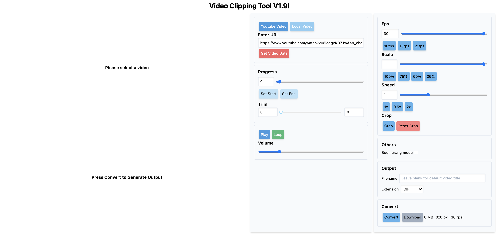

# Dead Simple Video Clipper

V2.0 update - much better speed with the help of WORKERFS

Simple video clipper to trim/convert videos to multiple formats

It basically runs ffmpeg commands for you with an interface for you to configure parameters.

Powered by [ffmpeg-wasm](https://github.com/ffmpegwasm/ffmpeg.wasm), [Nestjs](https://github.com/nestjs/nest), React and TypeScript

Try me now ! : http://video-clipper.herokuapp.com/ or http://video-clipper-coral.vercel.com/



## Run locally

By using docker image

```
docker run -p 3000:3000 hamzaabamboo/video-clipper
```

## Features

- Choose YouTube video as source
- Choose local file as video source (Supports most video formats + GIFs)
- Crop video
- Trim video
- Simple user interface (?)
- Optimized GIF creation
- Export to multiple formats
  - Image: GIF, JPG, PNG, APNG
  - Video: MP4, FLV, WebP, mov
  - Audio: mp3, wav
- Instagram boomerang effect

## Special Thanks

Big thanks from these libraries that make this possible

- [gifsicle-wasm](https://github.com/renzhezhilu/gifsicle-wasm-browser)
- [ffmpeg.wasm](https://github.com/ffmpegwasm/ffmpeg.wasm)

## Limitations

- Cannot convert long videos duration (Takes too much time)
- Support up to 2 GB of local files

## Sample

GIF creation


Cropping


Boomerang Mode


## Contribute

Feel free to create issue for feature request or pull request for new features

## TODO

- [ ] server computation
- [x] make it work with local videos
- [x] better UI
- [x] more formats
